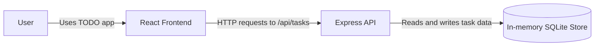
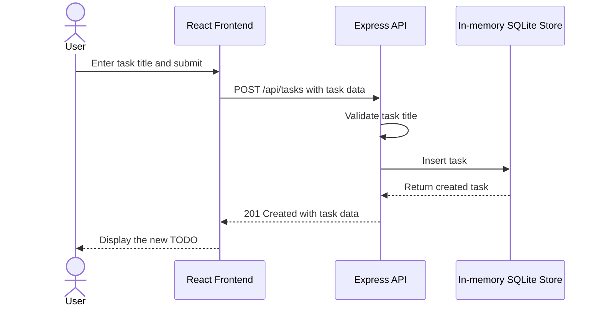

# Cloud Architecture Overview

This monorepo contains a React frontend and an Express API backed by an in-memory SQLite store. The store is initialized when the backend starts and is not persisted outside the running process.

## System Context

- **User** interacts with the TODO application through the React frontend.
- **React Frontend** renders task forms and lists and sends task operations to the API.
- **Express API** validates requests and provides task endpoints for creating, reading, updating, completing, and deleting tasks.
- **In-memory SQLite Store** holds task data for the lifetime of the backend process. Restarting the backend clears the data.

## Creating a TODO

